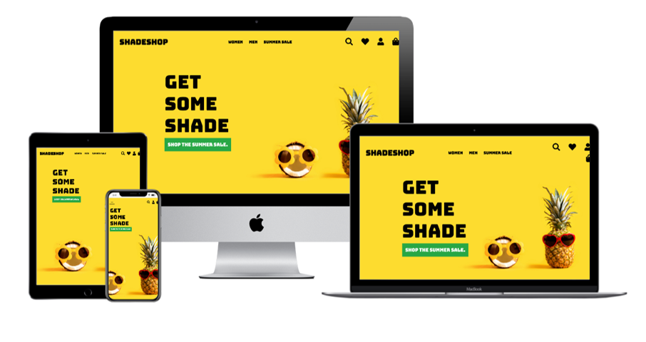
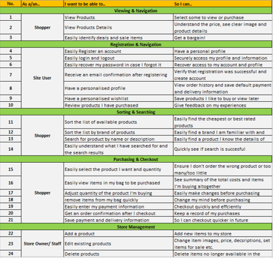
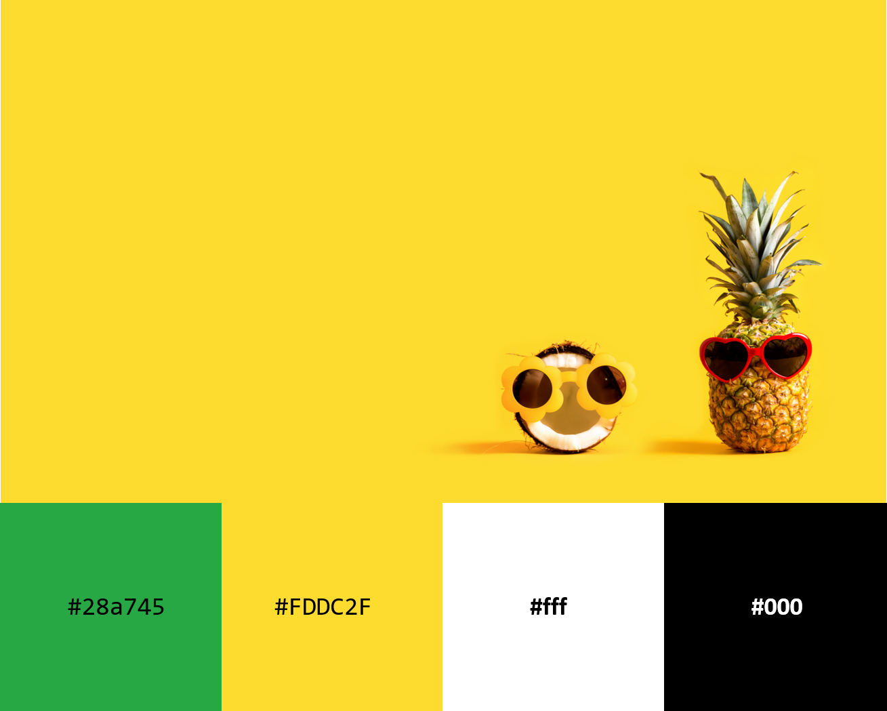
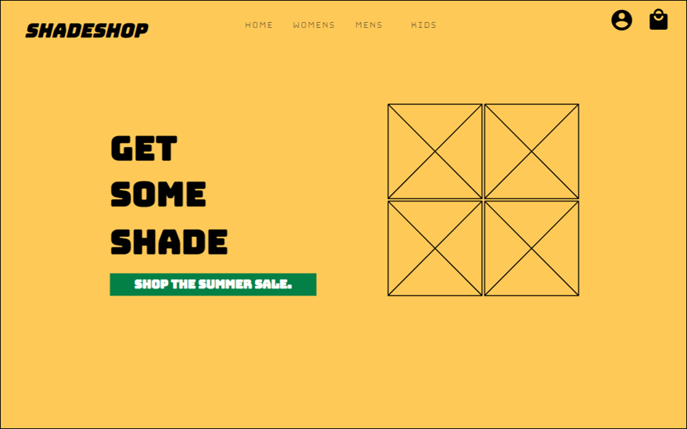
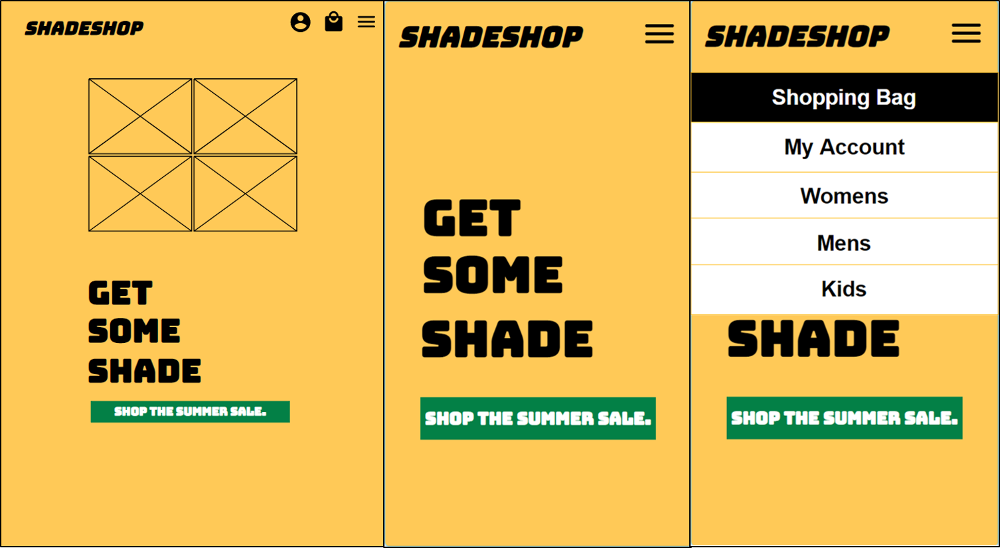

  

The concept for my website was an e-commerce shop selling sunglasses. The app was built using [GitHub](https://pages.github.com/) and deployed to [Heroku.](https://www.heroku.com/) All static files and media are stored using [AWS](https://aws.amazon.com/).

The live website can be found [here.](https://shadeshop-ms4.herokuapp.com/)

**<ins>Disclaimer<ins>**: 
The site has been developed for educational and assessment purposes, all work has been credited as appropriate and it is not the intention to use the site commercially. 

##Table of Contents##

**

 User Experience (UX)
**
  - [Purpose](#purpose)
  - [User stories](#user-stories)
  - [Design](#design)
  - [Wireframes](#wireframes)
  - [Database](#database)
  - [Data Schema](#data-schema)

**

 Features
**
  - [Features used](#features-used)
  - [To do list](#to-do-list)
  - [Status](#status)

**

 Technologies
**
  - [Languages](#languages)
  - [Frameworks, Libraries & Programs](#frameworks-libraries-programs)

**

 Deployment
**
  - [Deploy to Heroku](#deploy-to-heroku)
  - [Deploy to AWS](#deploy-to-aws)
  - [Accessing code](#accessing-code)

**

 Testing
**
  - [Testing](#testing)

**

 Credits
**
  - [Content](#content)
  - [Media](#media)
  - [Acknowledgements](#acknowledgements)

**

 Contact
**
  - [Contact details](#contact-details) 

# **User Experience**

### **Purpose**

As outlined above, the site is online e-commerce platform for a fictional shop called ShadeShop which sells sunglasses. The purpose of the site is to provide a modern, functional and fun webiste to entice customers to buy the products. 

For an educational standpoint, the purpose of the site is demonstrate my knowledge of the Code Institute Curriculum which culminates in this final milestone project. The projects combines my knowledge of HTML, CSS, JavaScript, Python, Django Framework and combining front and back end development. 

### **User Stories**

I developed a series of user stories from the perspective of a shopper, registered site user and store owner. 

The user stories are shown below and can also be found as pdf [here.](readme/files/userStories.pdf)

### **Design**

#### Colours

I wanted the design of the site to simple, modern and clean but also fun. The main colour choice, yellow for sun, was decided my imagery I found while researching the site and I used complementary and constrasting colours around this. Below shows the original image inspiration, also main image on home page, and the colour palette used. 

#### Typography

I choose 'Bungee' for the main heading and logo throughout the site as I thought it suited the modern but fun style. It's eyecatchig and bold but not too serious or formal. I choose lato as the completing font for all paragraphs, content etc as this was recommended as a complementary font by Google fonts. 

### **Wireframes**

I developed initial wireframes while planning the site using [Moqups](https://moqups.com/). The wireframes for desktop, tablet and mobile for the home page are shown below. Whilst, the design evolved during development I still think they give a reasonable impression of the final site and certainly helped with design process. More wireframes can be found [here.](readme/wireframes)

### Database

I employed a Relational Database to store the collection models needed for the site. I used [SQLite](https://www.sqlite.org/index.html) in development, as this is created by default by Django, and [Heroku Postgres](https://www.heroku.com/postgres) in production. Relational databases were a suitable choice for this project as it allows multiple tables to be created, with data easily connected through the use of foreign keys. All Models included are related to at least one other Model and implement common database relationships: many-to-one, many-to-many and one-to-one.

As per the project requirements I included a number of additional models not included in the CI Boutique Ado example site these included the Wishlist, Wishlistitem and Review models. The wish list models were for a seperate app 'Wishlist' and the review model was an inline model to the Products model within the Products app. 

### Data schema

# **Features**

### Home page

* Responsive Navbar with link to products by gender with dropdown for brands and sale items.
* Icon link to Shopping with tooltip with grand total, Wishlist, Profile with dropdowns to login/Logout register and product management if super user.
* Icon link which collapses search box with can be used to search and return product list based on search item. 
* hero image with link to sale products

### Women, Mens and Sale Product pages
 
* Count of the number of items with search query if returned by search.
* Option to sort by brand, price and rating
* Further image details on hovering product image
* Links to edit or delete product for super.user
* Scroll to top button

### Product Detail page

* Zoom on image over
* Image credit beneath the image
* Edit and delete product links for superuser
* adjust quantity incremental buttons
* display rating
* keep shopping button to return to product listing
* Add to bag button to add product to items for pruchase
* Add to wishlist button for registered user to save item on wish list
* summary of product reviews
* Ability to add review if you are logged in and have previously purchased the item
* Ability to delete review you have written

### Shopping bag

* line per item with update quantity and remove links
* individual price and subtotal per line
* Total before delivery
* Delivery cost 
* Grand Total
* Amount left to spend for free delivery
* return to shopping link
* secure checkout button

### Checkout & Checkout Success

* Checkout form prefilled if info saved
* Option to save info to profile if logged in
* Clear form vaildation & feedback
* Stripe payment element
* Loading overlay while payment processes
* Order summary and details of confirmation email when payment succedded
* Return to shopping link on order confirmation

### Wishlist

* List of items saved previously by registered users 
* Ability to remove or update quantity
* Button to add to shopping bag which removes items from wishlist

### Product Management (Add/Edit Products)

* Clear form to add product
* form prefilled when editing product
* preview of existing or selected image

### Responsiveness

* Responsive on all device sizes
* Home and wishlist links in dropdown menus on mobile

### Features to be implemented

* I would like to add a discount model in the future which could be applied on the shopping bag page;
* More products! Currently there is just enough products to demonstrate the functionality, a real e-commerce website would have far more. 
* More features for staff/admin including orders history, customers contact search and look and ability to add brands or edit multiple products at one for sales for instance (eg 20% of all Gucci Glasses).

## &rarr; **Technologies**

#### Languages

- [HTML5](https://en.wikipedia.org/wiki/HTML5)
- [CSS3](https://en.wikipedia.org/wiki/Cascading_Style_Sheets)
- [JavaScript](https://www.javascript.com/)
- [Python](https://www.python.org/)

#### Frameworks, Libraries & Programs

- [**Django**](https://www.djangoproject.com/)
  - Python Web framework used to build the app.

- [**Git**](https://git-scm.com/)
  - Git was used for version control.

- [**GitHub**](https://github.com/)
  - GitHub is used to store the project code during development.

- [**Heroku**](https://www.heroku.com/)
  - Heroku is the app platform the project was deployed to.

- [**Heroku Postgres**](https://www.heroku.com/postgres)
  - Heroku database used to store the data

- [**AWS**](https://aws.amazon.com/)
  - A cloud-based storage service used to store static and, media files.

- [**jQuery:**](https://jquery.com/)
  - A javascript library used to simplify DOM manipulation.

- [**Bootstrap 4.5.3**](https://getbootstrap.com/)
  - Bootstrap was used to assist with the responsiveness and styling of the website using design templates.

- [**Boto3**](https://boto3.amazonaws.com/v1/documentation/api/latest/index.html)
    - Python SDK for AWS, used to directly create, update, and delete AWS resources from my Python scripts.

- [**gunicorn**](https://gunicorn.org/)
   - WSGI server used to take care of everything happening between the web server and web application.

- [**pillow**](https://pypi.org/project/Pillow/2.2.1/)
    - Python Imaging Library (PIL), used to add support for opening, manipulating, and saving images.

- [**psycopg2**](https://pypi.org/project/psycopg2/)
    - PostgreSQL database adapter

- [**Stripe**](https://stripe.com/gb)
  - Stripe was used to deal with payments.

- [**Google fonts**](https://fonts.google.com/)
  - Google fonts were used to import the fonts into the CSS file which is used on all pages throughout the project.

- [**Font Awesome 4.7.0**](https://fontawesome.com/)
  - Font Awesome was used for all icons on site. 

- [**Moqups**](https://moqups.com/)
  - Moqups was used to create the wireframes.

- [**Grammarly**](https://www.grammarly.com/)
  - Grammarly was used to ensure any grammar errors are eliminated.

- [**W3 Validator**](https://validator.w3.org/#validate_by_input) and [**W3C CSS Validator**](https://jigsaw.w3.org/css-validator/#validate_by_input)
  - Used to validate my HTML and CSS files

- [**JShint**](https://jshint.com)
    - Used to validate JS code

- [**Favicon**](https://favicon.io/)
    - Used to create a favicon, displaying my logo on a web browser next to the web address bar, the browser tab, and the bookmarks bar.

- [**Techsini**](http://techsini.com/multi-mockup/index.php)
    - Multi Device Website Mockup Generator Tool

- [**Tiny Jpg**](https://tinyjpg.com/) 
    - To help compress image sizes

