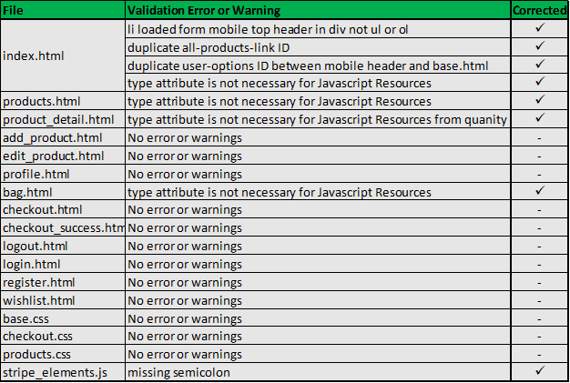
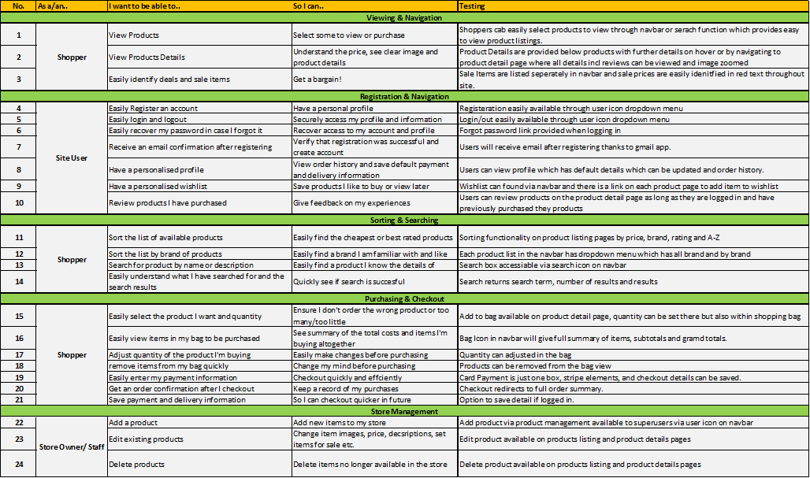

  
<hr>

The concept for my website was an e-commerce shop selling sunglasses. The app was built using [GitHub](https://pages.github.com/) and deployed to [Heroku.](https://www.heroku.com/) All static files and media are stored using [AWS](https://aws.amazon.com/).

The live website can be found [here.](https://shadeshop-ms4.herokuapp.com/)

Some Notes on the project
* Only logged in users can have a wishlist
* Only logged in users can leave a review and only if they have previously purchased the product in questions
* Stripe test card 4242 4242 4242 4242 with any expiry CVV and zip code should be used. 

**<ins>Disclaimer<ins>**: 
The site has been developed for educational and assessment purposes, all work has been credited as appropriate and it is not the intention to use the site commercially. 

##Table of Contents##

**<details><summary> User Experience (UX)</summary>**
  - [Purpose](#purpose)
  - [User stories](#user-stories)
  - [Design](#design)
  - [Wireframes](#wireframes)
  - [Database](#database)
</details>

**<details><summary> Features</summary>**
  - [Features](#features)
</details>

**<details><summary> Technologies</summary>**
  - [Languages](#languages)
  - [Frameworks, Libraries & Programs](#frameworks-libraries-programs)
</details>

**<details><summary> Deployment</summary>**
  - [Deploy to Heroku](#deploy-to-heroku)
  - [Deploy to AWS](#deploy-to-aws)
  - [Accessing code](#accessing-code)
</details>

**<details><summary> Testing</summary>**
  - [Testing](#testing)
</details>

**<details><summary> Credits</summary>**
  - [Media](#media)
  - [Acknowledgements](#acknowledgements)
</details>


# **User Experience**

### **Purpose**

As outlined above, the site is online e-commerce platform for a fictional shop called ShadeShop which sells sunglasses. The purpose of the site is to provide a modern, functional and fun webiste to entice customers to buy the products. 

For an educational standpoint, the purpose of the site is demonstrate my knowledge of the Code Institute Curriculum which culminates in this final milestone project. The projects combines my knowledge of HTML, CSS, JavaScript, Python, Django Framework and combining front and back end development. 

### **User Stories**

I developed a series of user stories from the perspective of a shopper, registered site user and store owner. 

The user stories are shown below and can also be found as pdf [here.](readme/files/userStories.pdf)


### **Design**

#### Colours

I wanted the design of the site to simple, modern and clean but also fun. The main colour choice, yellow for sun, was decided my imagery I found while researching the site and I used complementary and constrasting colours around this. Below shows the original image inspiration, also main image on home page, and the colour palette used. 


#### Typography

I choose 'Bungee' for the main heading and logo throughout the site as I thought it suited the modern but fun style. It's eyecatchig and bold but not too serious or formal. I choose lato as the completing font for all paragraphs, content etc as this was recommended as a complementary font by Google fonts. 

### **Wireframes**

I developed initial wireframes while planning the site using [Moqups](https://moqups.com/). The wireframes for desktop, tablet and mobile for the home page are shown below. Whilst, the design evolved during development I still think they give a reasonable impression of the final site and certainly helped with design process. More wireframes can be found [here.](readme/wireframes)


### Database

I employed a Relational Database to store the collection models needed for the site. I used [SQLite](https://www.sqlite.org/index.html) in development, as this is created by default by Django, and [Heroku Postgres](https://www.heroku.com/postgres) in production. Relational databases were a suitable choice for this project as it allows multiple tables to be created, with data easily connected through the use of foreign keys. All Models included are related to at least one other Model and implement common database relationships: many-to-one, many-to-many and one-to-one.

As per the project requirements I included a number of additional models not included in the CI Boutique Ado example site these included the Wishlist, Wishlistitem and Review models. The wish list models were for a seperate app 'Wishlist' and the review model was an inline model to the Products model within the Products app. 


# **Features**

### Home page

* Responsive Navbar with link to products by gender with dropdown for brands and sale items.
* Icon link to Shopping with tooltip with grand total, Wishlist, Profile with dropdowns to login/Logout register and product management if super user.
* Icon link which collapses search box with can be used to search and return product list based on search item. 
* hero image with link to sale products

### Women, Mens and Sale Product pages
 
* Count of the number of items with search query if returned by search.
* Option to sort by brand, price and rating
* Further image details on hovering product image
* Links to edit or delete product for super.user
* Scroll to top button

### Product Detail page

* Zoom on image over
* Image credit beneath the image
* Edit and delete product links for superuser
* adjust quantity incremental buttons
* display rating
* keep shopping button to return to product listing
* Add to bag button to add product to items for pruchase
* Add to wishlist button for registered user to save item on wish list
* summary of product reviews
* Ability to add review if you are logged in and have previously purchased the item
* Ability to delete review you have written

### Shopping bag

* line per item with update quantity and remove links
* individual price and subtotal per line
* Total before delivery
* Delivery cost 
* Grand Total
* Amount left to spend for free delivery
* return to shopping link
* secure checkout button

### Checkout & Checkout Success

* Checkout form prefilled if info saved
* Option to save info to profile if logged in
* Clear form vaildation & feedback
* Stripe payment element
* Loading overlay while payment processes
* Order summary and details of confirmation email when payment succedded
* Return to shopping link on order confirmation

### Wishlist

* List of items saved previously by registered users 
* Ability to remove or update quantity
* Button to add to shopping bag which removes items from wishlist

### Product Management (Add/Edit Products)

* Clear form to add product
* form prefilled when editing product
* preview of existing or selected image

### Responsiveness

* Responsive on all device sizes
* Home and wishlist links in dropdown menus on mobile

### Features to be implemented

* I would like to add a discount model in the future which could be applied on the shopping bag page;
* More products! Currently there is just enough products to demonstrate the functionality, a real e-commerce website would have far more. 
* More features for staff/admin including orders history, customers contact search and look and ability to add brands or edit multiple products at one for sales for instance (eg 20% of all Gucci Glasses).

# **Technologies**

#### Languages

- [HTML5](https://en.wikipedia.org/wiki/HTML5)
- [CSS3](https://en.wikipedia.org/wiki/Cascading_Style_Sheets)
- [JavaScript](https://www.javascript.com/)
- [Python](https://www.python.org/)

#### Frameworks, Libraries & Programs

- [**Django**](https://www.djangoproject.com/)
  - Python Web framework used to build the app.

- [**Git**](https://git-scm.com/)
  - Git was used for version control.

- [**GitHub**](https://github.com/)
  - GitHub is used to store the project code during development.

- [**Heroku**](https://www.heroku.com/)
  - Heroku is the app platform the project was deployed to.

- [**Heroku Postgres**](https://www.heroku.com/postgres)
  - Heroku database used to store the data

- [**AWS**](https://aws.amazon.com/)
  - A cloud-based storage service used to store static and, media files.

- [**jQuery:**](https://jquery.com/)
  - A javascript library used to simplify DOM manipulation.

- [**Bootstrap 4.5.3**](https://getbootstrap.com/)
  - Bootstrap was used to assist with the responsiveness and styling of the website using design templates.

- [**Boto3**](https://boto3.amazonaws.com/v1/documentation/api/latest/index.html)
    - Python SDK for AWS, used to directly create, update, and delete AWS resources from my Python scripts.

- [**gunicorn**](https://gunicorn.org/)
   - WSGI server used to take care of everything happening between the web server and web application.

- [**pillow**](https://pypi.org/project/Pillow/2.2.1/)
    - Python Imaging Library (PIL), used to add support for opening, manipulating, and saving images.

- [**psycopg2**](https://pypi.org/project/psycopg2/)
    - PostgreSQL database adapter

- [**Stripe**](https://stripe.com/gb)
  - Stripe was used to deal with payments.

- [**Google fonts**](https://fonts.google.com/)
  - Google fonts were used to import the fonts into the CSS file which is used on all pages throughout the project.

- [**Font Awesome 4.7.0**](https://fontawesome.com/)
  - Font Awesome was used for all icons on site. 

- [**Moqups**](https://moqups.com/)
  - Moqups was used to create the wireframes.

- [**Grammarly**](https://www.grammarly.com/)
  - Grammarly was used to ensure any grammar errors are eliminated.

- [**W3 Validator**](https://validator.w3.org/#validate_by_input) and [**W3C CSS Validator**](https://jigsaw.w3.org/css-validator/#validate_by_input)
  - Used to validate my HTML and CSS files

- [**JShint**](https://jshint.com)
    - Used to validate JS code

- [**Favicon**](https://favicon.io/)
    - Used to create a favicon, displaying my logo on a web browser next to the web address bar, the browser tab, and the bookmarks bar.

- [**Techsini**](http://techsini.com/multi-mockup/index.php)
    - Multi Device Website Mockup Generator Tool

- [**Tiny Jpg**](https://tinyjpg.com/) 
    - To help compress image sizes

# **Deployment**

#### Deploy to Heroku

The project was deployed to Heroku with all static and media files stored on a Amazon S3 bucket. Automatic deployment  was enabled in Heroku to ensure deloyed app is automatically up to date with the GitPod repository.

This project also requires a `Gmail Account` with an app secret password, to allow emails to be sent to users. Sign up for a Gmail account [here](https://accounts.google.com/signup/v2/webcreateaccount?hl=en&flowName=GlifWebSignIn&flowEntry=SignUp)

The site also utilises Stripe, the documentation for which can be found [here](https://stripe.com/docs)

<details>
<summary>Deploying to Heroku</summary>
<p>

> **Note:** Before following the below steps ensure you have already created your new repo in Github.

1. Log in (or Register) to [Heroku](https://www.heroku.com/) and from your dashboard click 'new' > 'create new app'.

2. Enter your 'App name' and choose the appropriate region, then click 'Create app'.

3. Then on the 'Resources' tab, search and add on the Heroku Postgres database.

4. To use Postgres, install dj_database_url, and psycopg2 in the project terminal using the following commands;

    `$ pip3 install dj_database_url`

    `$ pip3 install psycopg2`

5. Freeze the requirements to ensure Heroku installs all the apps requirements when deployed using the following command;

    `$ pip3 freeze > requirements.txt`

6. To migrate to the Postgres, go to settings.py and add the following import;

    `import dj_database_url`

   Then down in the databases setting comment out the default configuration and replace the default database with a call to dj_database_url.parse and give it the database URL from Heroku which can be found under the Heroku app setting config vars.

7. Apply all migrations using the following command;

    `$ python3 manage.py migrate`

    After migrations have been applied you will need to reupload the fixtures to the heroku database using. 

    `$ python3 manage.py loaddata brands`
    `$ python3 manage.py products`
    
    Your database should now be set up on heroku, when looking at the deloyed site you will notice a noticeable slow download speed which will improve later in the process. 

8. Create a superuser to log in with using the following command;

    `$ python3 manage.py createsuperuser`

9. Go to the Settings tab on Heroku, scroll to the 'Config Vars' section, and click 'Reveal Config Vars'. 

   Enter the variables (key and value) contained in your gitpod environment setting. The keys are listed below and values are inputted by the user.

| Key               | Value               |
|-------------------|---------------------|
| AWS_ACCESS_KEY_ID | To be added by user |
| AWS_SECRET_KEY_ID | To be added by user |
| USE_AWS           |        TRUE         |
| DATABASE_URL      | To be added by user |
| EMAIL_HOST_PASS   | To be added by user |
| EMAIL_HOST_USER   | To be added by user |
| SECRET_KEY        | To be added by user |
| STRIPE_PUBLIC_KEY | To be added by user |
| STRIPE_SECRET_KEY | To be added by user |
| STRIPE_WH_SECRET  | To be added by user |

10. Install gunicorn using the following command;

    `$ pip3 install gunicorn`

    Then freeze into your requirements file.

11. Create a Procfile and add the following line;

    `web: gunicorn shadeshop_MS4.wsgi:application`

    This tells Heroku to create a web dyno which will run gunicorn and serve the Django app.

   
12. Last, you need to temporarily disable collectstatic to ensure that Heroku won't try to collect static files when we deploy. This is done by adding the below variable;

    | DISABLE_COLLECTSTATIC  | 1 |

13. Add the hostname of your Heroku app to allowed hosts in settings.py

14. Now you can commit all the changes and push to GitHub;

    `$ git add .`
    `$ git commit -m <'your commit message'>`
    `$ git push`

    If you created your app on the website you will need to initialize your Heroku git remote using the following command;

    `$ heroku git:remote -a shadeshop_MS4`

    Then use the following command to push to Heroku;

    `$ git push heroku master`

</p>
</details>

<details>
<summary>Deploying AWS Static and Media files</summary>
<p>

The project used Amazon Web Services s3, which is a cloud-based storage service, to store static and media files.

1. Create an account by navigating to [aws.amazon.com](https://aws.amazon.com/) and clicking create an AWS account. Fill in your email and password, and a username for your account, and select continue.

2. Now on the account type page, select personal and fill out the required information, click create an account and continue.

3. Next you will be asked to enter a credit card number which will be used for billing if we go above the free usage limits. Beyond this, you'll be asked a couple more verification questions then once all required information is confirmed your account will be created.

   > **Note**: For this project, I didn't go anywhere near the usage limits but keep in mind that AWS is not free if you go above the free usage limits.

4. Now you can navigate back to [aws.amazon.com](https://aws.amazon.com/) and sign-in to your account.

5. Navigate to AWS management console under my account and using the 'find services' search bar, find s3.

6. Now open s3 and create a new bucket to store all your files.

- Enter a name for your bucket

- Select a region (select your geographically closest region)

- Uncheck block all public access and acknowledge that the bucket will be public.

- Click create bucket and your bucket should be created.

7. Now click into your new bucket and set some settings;

- On the properties tab and turn on static website hosting.

- On the permissions tab 

  - Paste in a **CORS Configuration** to set up the required access between your Heroku app and this s3 bucket. Copy the code below supplied by CodeInstitute;

        [
        {
            "AllowedHeaders": [
                "Authorization"
            ],
            "AllowedMethods": [
                "GET"
            ],
            "AllowedOrigins": [
                "*"
            ],
            "ExposeHeaders": []
        }
        ]

  - In the **Bucket Policy** tab, select policy generator
    - Policy type is 's3 bucket policy'
    - Allow all principles using a *
    - Actions is 'GetObject'
    - Add in your ARN (found on previous page)
    - Click 'Add statement' then 'Generate policy'
    - Copy the policy code and paste it into the bucket policy editor

       > **Note:** To allow access to all resources in this bucket add a slash star onto the end of the resource key.
    
    - Click save

  - In the **Access Control List** tab, under the Public Access section, set the list objects permission to everyone.

8. Create a user to access the bucket created.

- Search for a new service 'IAM'
- Now open IAM, navigate to 'groups' and click 'Create new group'
- Create a policy by navigating to 'policies' and click 'Create policy'
- Go JSON tab and click 'import managed policy'
  - Search for s3 and then import the s3 full access policy.
    - Replace resource value '*' with your bucket ARN from the bucket policy page;

    "Resource": [
        "arn:aws:s3:::shadeshop-ms4",
        "arn:aws:s3:::shadeshop-ms4/*"
    ]

  - Click 'Review policy', give it a name and a description and click 'Create policy'

9. Attach the policy to the group you created.
- Navigate to 'groups', select the group you created and on permissions tab select 'Attach policy'.
- Search for the policy you created, select it and click 'Attach policy'.

- Now to create the user, navigate to 'users' and click 'Add user'
  - Add username, select programmatic access and click 'Next'
  - Add user to a group by selecting the group you created and click 'Next' then click through to the end and click 'Create user'
  - Now download the CSV file which will contain this users access key and secret access key

10. To connect to Django, head to your project and install two new packages then freeze them into your requirements.txt;
  - $ pip3 install boto3
  - $ pip3 install django-storages
  - $ pip3 freeze > requirements.txt

11. In settings, add 'storages' to installed apps.

12. To connect Jdango to s3 add the below settings in settings.py which will tell it which bucket it should be communicating with;

        if 'USE_AWS' in os.environ:
            AWS_STORAGE_BUCKET_NAME = 'shadeshop-ms4'
            AWS_S3_REGION_NAME = 'eu-west-2'
            AWS_ACCESS_KEY_ID = os.environ.get('AWS_ACCESS_KEY_ID')
            AWS_SECRET_ACCESS_KEY = os.environ.get('AWS_SECRET_ACCESS_KEY')
            AWS_S3_CUSTOM_DOMAIN = f'{AWS_STORAGE_BUCKET_NAME}.s3.amazonaws.com'


13. Create a file called custom_storages.py and add the content below;

        from django.conf import settings
        from storages.backends.s3boto3 import S3Boto3Storage


        class StaticStorage(S3Boto3Storage):
            location = settings.STATICFILES_LOCATION


        class MediaStorage(S3Boto3Storage):
            location = settings.MEDIAFILES_LOCATION

    Then in settings.py add the below:

        STATICFILES_STORAGE = 'custom_storages.StaticStorage'
        STATICFILES_LOCATION = 'static'
        DEFAULT_FILE_STORAGE = 'custom_storages.MediaStorage'
        MEDIAFILES_LOCATION = 'media'

        STATIC_URL = f'https://{AWS_S3_CUSTOM_DOMAIN}/{STATICFILES_LOCATION}/'
        MEDIA_URL = f'https://{AWS_S3_CUSTOM_DOMAIN}/{MEDIAFILES_LOCATION}/'
</p>
</details>

<details>
<summary>Setting up Automatic Deployment to Heroku</summary>
<p>

1. From the Heroku deploy tab, select the Deployment method 'GitHub'.

2. On the 'Connect to GitHub' section make sure your GitHub profile is displayed then add your repository name and click 'Search'.

3. Your repo should now be displayed below, click 'Connect' to connect to this app.

4. Go to the Deploy tab on Heroku and under the Automatic deployment section, click 'Enable Automatic Deploys'. Then under Manual deploy click 'Deploy Branch'.

   - Heroku will now receive the code from GitHub and start building the app using the required packages.
   - Once built you will receive the message 'Your app was successfully deployed' and you can click 'View' to launch your new app.

</details>


<details>
<summary>Accessing the Project Code</summary>
<p>
    Forking allows you to create a copy of the original repository and propose changes to the repository owner via a pull request.
</p>
</details>

<details>
<summary>Forking the GitHub Repository</summary>
<p>

1. Log in to GitHub and locate the GitHub Repository. ShadeShop repository can be found [here](https://github.com/allanahmurphy/shadeshop_MS4/)

2. At the top of the Repository (not top of page) just above the "Settings" button on the menu, locate the "Fork" button.

3. You should now have a copy of the original repository in your GitHub account.

</p>
</details>

<details>
<summary>Making a Local Clone</summary>
<p>

1. Log in to GitHub and locate the GitHub Repository.
   
   ShadeShop repository can be found [here](https://github.com/allanahmurphy/shadeshop_MS4/)

2. Under the repository name, click the "download code" option.

   

3. To clone the repository using HTTPS, under "Clone with HTTPS", copy the link.

   

4. Open Git Bash

5. Change the current working directory to the location where you want the cloned directory to be made.

6. Type git clone, and then paste the URL you copied in Step 3.

    ```
    $ git clone https://github.com/YOUR-USERNAME/shadeshop_MS4.git
    ```

7. Press Enter. Your local clone will be created.

    ```
    $ git clone https://github.com/YOUR-USERNAME/shadeshop_MS4.git

    > Cloning into `shadeshop_MS4`...
    > remote: Enumerating objects: 299, done.
    > remote: Counting objects: 100%, (299/299),  done.
    > remote: Compressing objects: 100% (156/156), done.
    > Receiving objects: remove: Total 299 (delta 145), reused 267 (delta 126), pack-reused 0
    > Receiving objects: 100% (299/299), 4.61MiB | 2.98 MiB/s, done.
    > Resolving deltas: 100% (145/145), done. Unpacking objects: 100% (10/10), done.
    ```

    Now, you have a local copy of your fork of the ShadeShop repository.

    > **Note:** The repository name and output numbers that you see on your computer, representing the total file size, etc, may differ from the example I have provided above.

8. Either store your sensitive data in your environment settings or add an env.py file to your workspace (More details above).

   > **Note:** Contact the site owner if you want more information on the environment variables that have been included.

9. Install all requirements using the following command;

    `$ pip3 install -r requirements.txt`

10. Apply all migrations using the following command;

    `$ python3 manage.py migrate`
    
    Your database should now be all set up.

11. Create a superuser to log in with using the following command;

    `$ python3 manage.py createsuperuser`

12. You can now run your project locally using the following command;

    `$ python3 manage.py runserver`

</p>
</details>

# **Testing**

### **Code Validation**

Each page was ran through the W3C HTML validator, the stylesheet through the CSS validator and the javascript files through JS hint. A summary of the errors and warning by page are outlined below. 



There was additional warnings for the JavaScript files which highlighted undefined functions and variables, however these are defined in external JS libraries read in prior to the project JS files. There was also some warnings in relation to Internet Explorer compatibility which could not be addressed.

### **Browser Compatibility**

The live website, hosted on gitpages, has been opened and tested on multiple browsers for responsives and intended appearance. Browers tested included:

* Google Chrome
* Safari
* Microsoft Edge
* Internet Explorer
* Firefox
* Opera

Overall the website worked well and appeared as intended on different sizes across different browsers. 

### **Responsiveness**

The website has been tested across multiple screen sizes using [Google Chrome developer tools](https://developers.google.com/web/tools/chrome-devtools) for a range of screen sizes, portrait and landscape, including:

- Moto G4
- Galaxy S5
- Pixel 2
- Pixel 2 XL
- iPhone 5 SE
- iPhone 6/7/8
- iPhone 6/7/8 Plus
- iPhone X
- iPad
- iPad Pro

The screen was also adjusted through various sizes and breakpoints with the responsive option in developer tools. The website was also opened and checked on Samsung A20 & iPhone SE mobile devices as well as Dell xps 15, Lenovo Think Pad and Apple Macbook. The responsiveness was also tested on the browsers outlined above with no noted issues. Overall the website appeared as intended across each screen type. There were some intial errors particularly on iPhone5 screen size (320px width) with overflows of titles. However, an additional media query was added to address this and all screens less than 400px approximately. 

### **User Stories**

All user stories were tested as shown below and found [here](readme/files/userStoriesTesting.pdf)



#### Media & Credits

- Code Institue Boutique Ado Example project. Though I have tried to make the project my own as much as possible I still relied heavily on this example project. 
- General site content and product descriptions was created by me.
- Images were sourced on Unsplash, the credit for each image from Unpslash given under the image on the product details page and outlined below.

* pp100001.jpg -Photo by Laura Chouette on Unsplash
* pp100002.jpg -Photo by Oleksandr Koval on Unsplash
* pp100003.jpg -Photo by Ali Pazani on Unsplash
* pp100004.jpg -Photo by Kumpan Electric on Unsplash
* pp100005.jpg -Photo by Sara Dabaghian on Unsplash
* pp100006.jpg -Photo by Omid Armin on Unsplash
* pp100007.jpg -Photo by Brooke Cagle on Unsplash
* pp100008.jpg -Photo by Charles Deluvio on Unsplash
* pp100009.jpg -Photo by Michele Seghieri on Unsplash
* pp100010.jpg -Photo by yang miao on Unsplash
* pp100011.jpg -Photo by Jakayla Toney on Unsplash
* pp100012.jpg -Photo by Ashley Byrd on Unsplash
* pp100013.jpg -Photo by Gursimrat Ganda on Unsplash
* pp100014.jpg -Photo by Cameron Venti on Unsplash
* pp100015.jpg -Photo by Scorpio Creative on Unsplash
* pp100016.jpg -Photo by Apostolos Vamvouras on Unsplash
* pp100017.jpg -Photo by Greg Rosenke on Unsplash
* pp100018.jpg -Photo by Suka Endara on Unsplash
* pp100019.jpg -Photo by Suka Endara on Unsplash
* pp100020.jpg -Photo by Chandrachur Lahiri on Unsplash
* pp100021.jpg -Photo by Habib Dadkhah on Unsplash
* pp100022.jpg -Photo by christian buehner on Unsplash
* pp100023.jpg -Photo by Carlos Bryan on Unsplash
* pp100024.jpg -Photo by vahid kanani on Unsplash

- The other images were found through [shutterstock](https://www.shutterstock.com/home) using a free trial.


#### Acknowledgments

- My Mentor, Precious for his continuous help and support throughout the project.

- The help and support received from the tutors at [Code Institute](https://codeinstitute.net/).

- The [Code Institute](https://codeinstitute.net/) Slack Community.

- Friends & Family for continuous feedback and support.